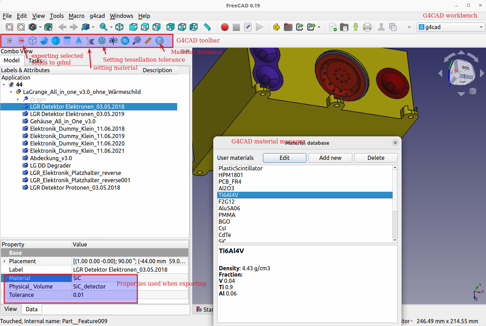

[](https://doi.org/10.5281/zenodo.7085915)
# G4CAD   - A FreeCAD workbench for converting CAD files to GDML 

Physicists usually spend most of the time developing the mass model when developing a Geant4-based Monte Carlo simulation package. For simple geometries, it is relatively easy to describe them using CGS models. However, this becomes almost impossible for complex geometries. G4CAD is a free, open-source FreeCAD workbench developed by SE2S founders.  With the workbench and FreeCAD, users can 

* import and edit CAD files
* set materials and material management. Users can define their own materials and set the predefined materials for different solids
* add simple CGS models 
* set the tessellation tolerance for each individual solid
* convert models to GDML files

G4CAD also provides other tools useful for creating mass models and converting CAD files to GDML, like measuring tools, tools to find /remove small solids. 


## Installation
Make sure you have already installed FreeCAD 0.19 or 0.20 (should also work with v0.17 and v0.18).
* To install it on Linux, execute the following commands:

 ```sh
   git clone --depth 1 https://github.com/drhlxiao/g4cad
   mkdir -p ~/.FreeCAD/Mod
   cp -r g4cad/g4cad ~/.FreeCAD/Mod
 ```
 * To install it on Windows, please follow the steps as below:
   *  Download the source code https://github.com/drhlxiao/g4cad/archive/refs/heads/main.zip
   *  unzip file downloaded file
   *  copy g4cad/g4cad  to   <FREECAD_INSTALLATION_PATH>/Mod. 
     You should have user_materials.json in the folder <FREECAD_INSTALLATION_PATH>/Mod/g4cad/ 


## Typical Workflow
<ol>
<li> Open FreeCAD </li>
 <li> Activate the workbench "G4CAD" in FreeCAD (view->Workbench->g4cad)</li>
 <li> Import a CAD file </li>
 <li> Click the icon "add world volume" in the G4CAD toolbar to add a world volume </li>
 <li> Select a solid or multiple solids, set  material(s) 
	<ul><li> If not set, the default material G4_Al is used when exporting </li>
	<li> Adding more materials: open the file user_materials.json in the source code folder, open it with a text editor,  add materials to it, validate the json file before saving it. </li>
  </ul>
<li> Select the solids in the tree view to be exported</li>
<li> click the button "Export solids to GDML files" in the toolbar to generate GDML files
	<ul>
  <li>Only visible solids will be exported</li>
  <li> 
 If everything goes well, GDML files will be written to gdml/ in your specified folder and a log file will also be created.  
  </li></ul>
 </li>
<li> Reading the exported GDML files in Geant4
Here is a code snippet 
 </li>
 </ol>

```cpp 
G4VPhysicalVolume* DetectorConstruction::Construct(){
G4String worldGdmlFilename="<GDML_PATH>/gdml/World.gdml"
G4GDMLParser parser;
parser.Read(worldGdmlFilename);
world = parser.GetWorldVolume();     
//other code goes here
  return world;
}
 ```


## Cite this work
If you use G4CAD in your work, please use the following citation,
```sh
@software{g4cad,
  author       = {Hualin Xiao, Wojtek Hajdas},
  title        = {{g4cad - A freecad workbench for converting CAD 
                   files to gdml}},
  month        = sep,
  year         = 2022,
  publisher    = {Zenodo},
  version      = {v1.0},
  doi          = {10.5281/zenodo.7085915},
  url          = {https://doi.org/10.5281/zenodo.7085915}
}
```
## Extended services

Extended services related to this tool can be provided by SE2S.

SE2S GmbH is a Swiss-based high-tech company with over 30 years of experience in radiation qualification, particle detection, and data analysis. Its founders gathered profound expertise in radiation qualification and testing, electronics design, hardware and software development, and data evaluation for applications in aerospace.  SE2S GmbH offers next-generation services and products in the following fields:
* Radiation detection systems
* Radiation analysis software and services
* Radiation qualification and testing services
For more info about SE2S, please visit:  [https://se2s.ch](https://se2s.ch)

 ## Screenshot
 * G4CAD Workbench


